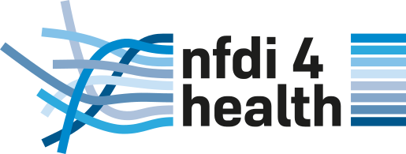

   

# NFDI4Health Knowledge Base

The NFDI4Health Knowledge Base is a modular platform designed to support training and guidance across the entire research data lifecycle in the health domain. It serves as both a self-learning resource and the foundation for structured training activities, including synchronous courses and summer schools.

The Knowledge Base integrates NFDI4Health services such as the Health Study Hub, Local Data Hub, FDPG/Central Access Point, Toolbox, Terminology Service, DataSHIELD, and synthetic data tools. It is continuously developed based on community needs and feedback gathered through helpdesk interactions.

This resource is collaboratively maintained by data stewards and service experts, following an open, GitHub-based workflow that enables transparent contribution, review, and publication processes.

*This Knowledge Base is inspired by the structure and workflow of RDMkit (ELIXIR Europe) and adapted for NFDI4Health.*

## Contribute

The NFDI4Health Knowledge Base is a collaborative, community-driven resource, and contributions are very welcome. Content is developed in Markdown and structured using a templating system (Jekyll) to generate a dynamic and accessible website.

We invite data stewards, service owners, and domain experts to contribute to the development and continuous improvement of this resource. Contributions may include new content, updates, examples, or feedback based on user needs.

To get involved, please refer to:

* Code of Conduct
* Contribution Guidelines

For questions or coordination, please contact the editorial team at:
[NFDI4Health HelpDesk](mailto:nfdi4health-training@yourdomain.org)

If you would like to work with the repository locally, please consult the Git and contribution guidelines provided in this repository.

---

## About NFDI4Health

NFDI4Health is part of the German National Research Data Infrastructure (NFDI) and focuses on enabling efficient, secure, and FAIR health research data management. It connects key stakeholders, including researchers, data stewards, and infrastructure providers, to support data sharing and reuse across the health research landscape.

The initiative provides a range of services such as the Health Study Hub, Local Data Hub, FDPG/Central Access Point, Toolbox, Terminology Service, DataSHIELD, and synthetic data tools. These services are integrated into this Knowledge Base to support training and practical implementation.

---

## License

Unless otherwise stated, the content of this Knowledge Base is made available under a CC-BY 4.0 license. The underlying software and technical components are provided under an MIT license. This is inlined with the NFDI4Health [Publication policy](https://zenodo.org/records/6257742)

This Knowledge Base is adapted from RDMkit (ELIXIR Europe), and appropriate attribution is maintained in accordance with the original licensing terms.

---

## Acknowledgements

This work builds upon the structure and concepts of RDMkit, developed by ELIXIR Europe. We acknowledge their contribution to advancing research data management practices.

NFDI4Health is funded within the framework of the National Research Data Infrastructure (NFDI) initiative in Germany and supported by participating institutions and partners.

